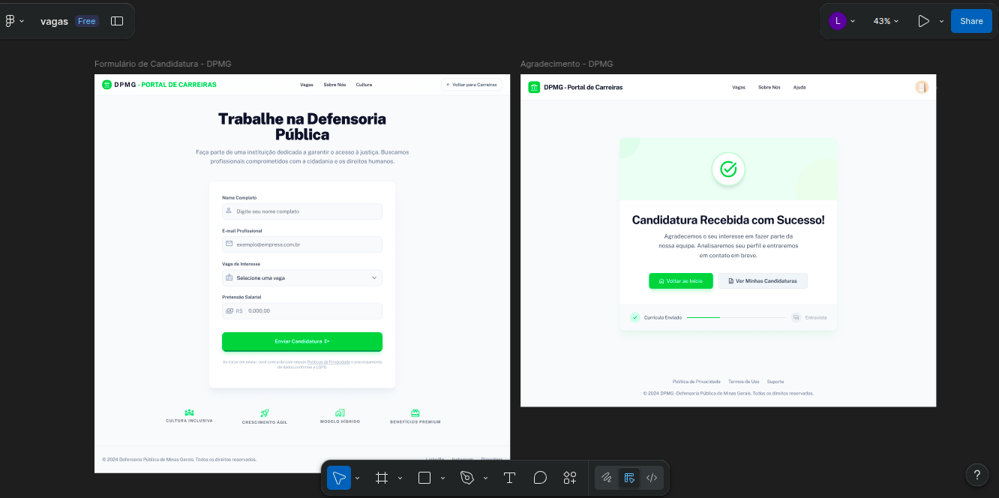
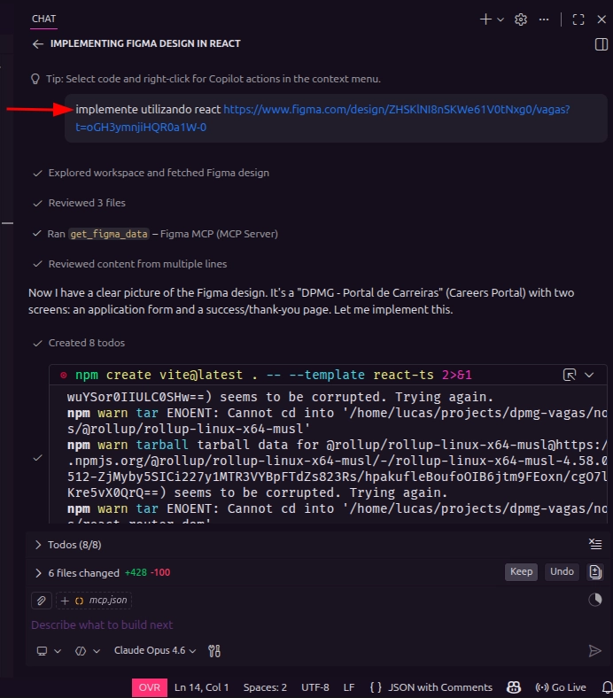
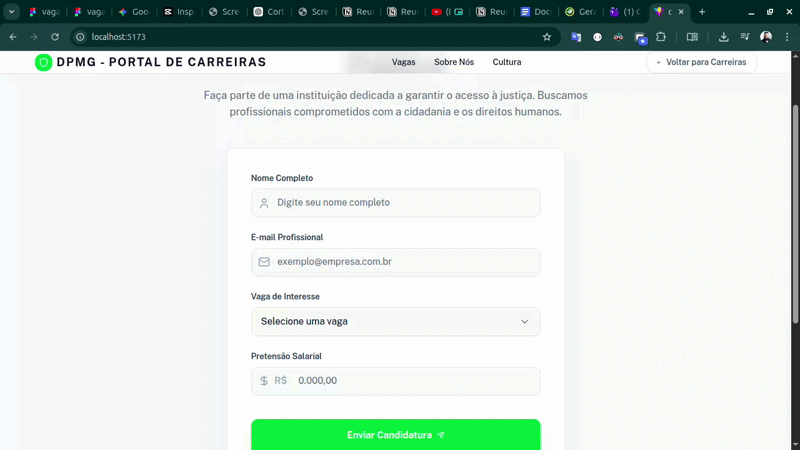

# Conexão via MCP, IDE e Figma

<div align="justify">

**Objetivo:** Estabelecer a integração entre o Figma, a IDE e o Protocolo de Contexto de Modelo (MCP) para acelerar o desenvolvimento do frontend com base em layouts pré-definidos.

---

### 1. Acesso ao Projeto no Figma

O ponto de partida é a obtenção da URL de referência do design. O link abaixo direciona para o layout oficial que servirá de base para a implementação:

[Acessar projeto no Figma](https://www.figma.com/design/ZHSKlNI8nSKWe61V0tNxg0/vagas?t=oGH3ymnjiHQR0a1W-0)



### 2. Configuração do MCP no VSCode

Para que o agente de IA consiga interpretar os elementos do design, é necessário configurar o servidor do Figma MCP. Crie o arquivo `.vscode/mcp.json` e insira as configurações abaixo, substituindo `SUA_CHAVE_FIGMA` pela sua chave de API pessoal.

```json
{
  "servers": {
    "Figma MCP": {
      "command": "npx",
      "args": [
        "-y",
        "figma-developer-mcp",
        "--figma-api-key=SUA_CHAVE_FIGMA",
        "--stdio"
      ]
    }
  }
}
```

### 3. Implementação Automatizada via Prompt

Com a conexão configurada, utiliza-se o chat da IDE para solicitar a implementação. O agente analisará os componentes do Figma e gerará a estrutura inicial de código.



**Nota sobre o desempenho:** Este passo pode levar cerca de 10 minutos, pois o modelo realiza a configuração de pacotes, estrutura o projeto e corrige eventuais erros de execução automaticamente.

### 4. Validação e Resultado Final

O processo automatiza a base do projeto, entregando uma estrutura funcional. Embora ajustes finos de UI possam ser necessários, a economia de tempo na criação do código estrutural é significativa, permitindo foco total em regras de negócio complexas.



</div>
