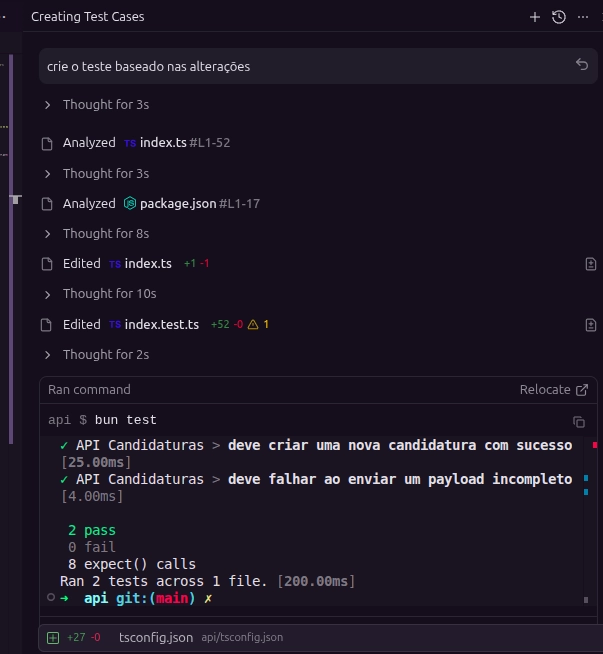

# Testes Automatizados por IA

<div align="justify">

**Objetivo:** Após alterar o código, o desenvolvedor pode instruir o chat a gerar os testes automaticamente. À medida que o projeto cresce, essa automação garante a integridade do sistema ao criar ou corrigir funcionalidades, evitando regressões.

---

### 1. Implementação da Funcionalidade

O primeiro passo consiste em desenvolver a lógica de negócio. No exemplo abaixo, temos uma rota para salvar candidaturas no banco de dados:

```ts
.post(
    '/candidaturas',
    async ({ body, set }) => {
        try {
            const result = await sql`
        INSERT INTO candidaturas (name, email, job, salary)
        VALUES (${body.name}, ${body.email}, ${body.job}, ${body.salary})
        RETURNING *
    `;

            set.status = 201;
            return { success: true, candidatura: result[0] };
        } catch (error) {
            console.error('Erro ao salvar no banco:', error);
            set.status = 500;
            return { success: false, error: 'Erro ao salvar a candidatura no banco de dados' };
        }
    },
)
```

### 2. Geração dos Testes via Prompt

Para criar os testes unitários, basta solicitar ao agente de IA através do chat. O comando deve ser claro, indicando qual arquivo ou trecho de código deve ser testado.



### 3. Resultado: Criação do Arquivo `index.test.ts`

Com base no código fornecido, o agente gera automaticamente a suíte de testes correspondente, cobrindo casos de sucesso e cenários de erro (e.g., payload incompleto).

```ts
import { describe, it, expect } from 'bun:test';
import { app } from './index';

describe('API Candidaturas', () => {
    it('deve criar uma nova candidatura com sucesso', async () => {
        const payload = {
            name: 'Candidato Teste',
            email: 'candidato@teste.com',
            job: 'Desenvolvedor Fullstack',
            salary: '8000'
        };

        const req = new Request('http://localhost/candidaturas', {
            method: 'POST',
            headers: {
                'Content-Type': 'application/json'
            },
            body: JSON.stringify(payload)
        });

        const response = await app.handle(req);

        expect(response.status).toBe(201);

        const body: any = await response.json();
        expect(body.success).toBe(true);
        expect(body.candidatura).toBeDefined();
        expect(body.candidatura.name).toBe(payload.name);
        expect(body.candidatura.email).toBe(payload.email);
        expect(body.candidatura.job).toBe(payload.job);
        expect(body.candidatura.salary).toBe(payload.salary);
    });

    it('deve falhar ao enviar um payload incompleto', async () => {
        const req = new Request('http://localhost/candidaturas', {
            method: 'POST',
            headers: {
                'Content-Type': 'application/json'
            },
            body: JSON.stringify({
                name: 'Candidato Incompleto'
            })
        });

        const response = await app.handle(req);
        expect(response.status).toBe(422);
    });
});
```

### 4. Conclusão

A criação de testes para cada nova funcionalidade torna a aplicação resiliente a mudanças futuras. Estes testes podem ser integrados ao fluxo de *pre-commit* ou executados automaticamente via pipeline de CI/CD.

</div>
