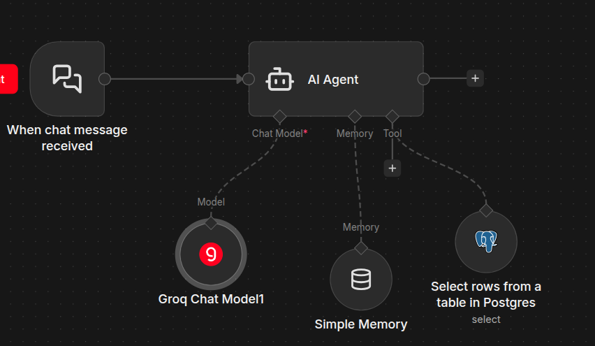
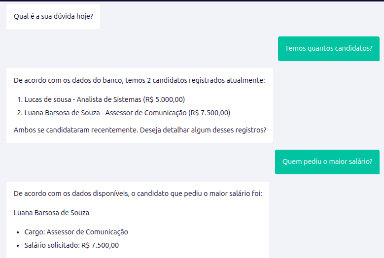

# Consultas de Dados Internos com IA

## Objetivo
Criar um chat inteligente com IA para responder a dúvidas sobre as informações internas do sistema corporativo **Vagas**.

## Arquitetura (Workflow no n8n)
O assistente virtual foi construído usando um workflow de Agente de IA no **n8n**.

**Componentes principais:**
- **Trigger**: Recebe e processa a mensagem de entrada do usuário.
- **AI Agent**: O cérebro da operação, que orquestra a inteligência usando o modelo **Groq**.
- **Memory**: Mantém o contexto de toda a conversa.
- **Tools (Postgres)**: O Agente acessa o banco de dados interno em tempo real para obter respostas precisas sobre as vagas.

## Interface do Usuário (Chat)
A interface de comunicação é o chat interativo nativo disponibilizado pelo n8n.

Para interagir com a IA e consultar os dados internos:
- **Acessar o Chat**: [Link da Interface Externa](https://n8n.dizelequefez.com.br/webhook/2d1580d0-4c1a-4a97-b977-088bfc31e4a3/chat)

Nesta tela, basta a equipe digitar a dúvida, e o agente buscará os dados diretamente do sistema principal.

