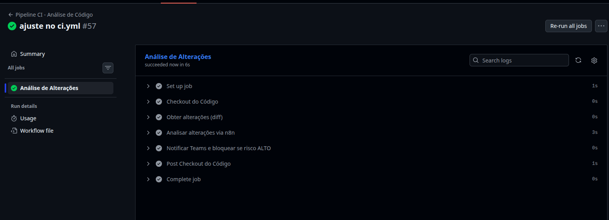
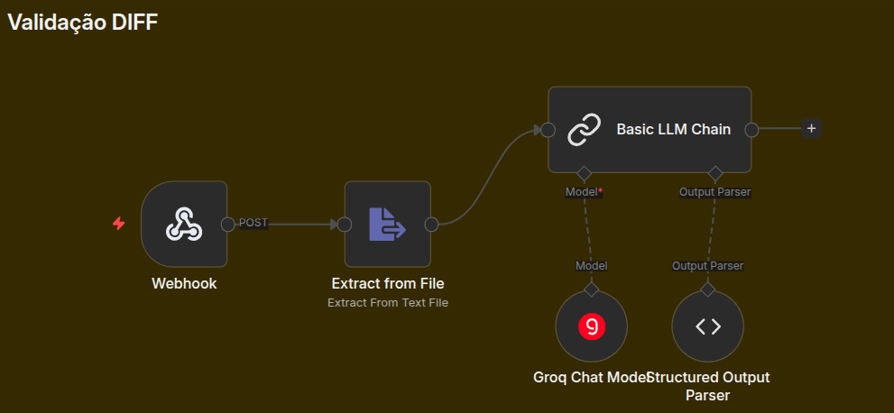
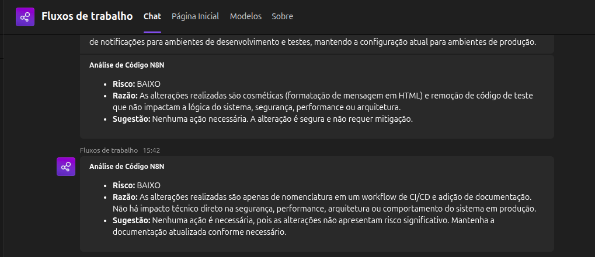

# IA/CI/CD

**Objetivo:** Utilizar IA para verificar se o código possui vulnerabilidades de segurança e se está de acordo com as boas práticas de desenvolvimento.

---

### 1. Visão Geral do Pipeline

O pipeline de CI/CD foi configurado utilizando o GitHub Actions (`.github/workflows/ci.yml`). Ele é acionado automaticamente em eventos de *push* para a branch `main` ou na criação/atualização de um *Pull Request*. O fluxo principal consiste em:

1. Extrair as alterações de código (*diff*).
2. Enviar essas alterações para um *webhook* do **n8n**.
3. O agente de Inteligência Artificial processa no n8n a análise do código inserido e retorna uma avaliação de risco.
4. O GitHub Actions notifica a equipe via Microsoft Teams e bloqueia o processo caso o risco seja alto.



### 2. Extração e Análise do Código

No *step* `Obter alterações (diff)`, o pipeline calcula exatamente o que foi modificado em relação ao commit anterior ou branch base, salvando o patch no arquivo `content.diff`.

Em seguida, o *step* `Analisar alterações via n8n` realiza uma requisição HTTP enviando esse diff para o n8n. A URL do n8n fica protegida de forma segura nos *secrets* do GitHub (`N8N_WEBHOOK_URL`).

```yaml
      - name: Analisar alterações via n8n
        run: |
          # ...
          RESPONSE=$(curl -s -X POST \
            -F "data=@content.diff" \
            "${{ secrets.N8N_WEBHOOK_URL }}")
```

A IA processa o *diff* e retorna um JSON padronizado contendo o nível de `risco`, a `razao` (justificativa da avaliação) e uma `sugestao` de melhoria ou correção.



### 3. Notificações no Microsoft Teams

Após a extração da resposta da IA, o *workflow* formata os dados em HTML e dispara uma mensagem automatizada para o canal da equipe no Teams, utilizando a variável protegida `TEAMS_SEND_MESSAGE_URL`.

Abaixo um exemplo de como é estruturada a notificação usando as respostas da IA:

```html
<h3>Análise de Código N8N</h3>
<ul>
  <li><b>Risco:</b> ALTO</li>
  <li><b>Razão:</b> [Motivo apontado pela IA]</li>
  <li><b>Sugestão:</b> [Sugestão de correção apontada pela IA]</li>
</ul>
```

Essa integração garante um ciclo de *feedback* rápido para os desenvolvedores que enviaram o código.



### 4. Bloqueio Preventivo (Gatekeeper)

O grande diferencial desta automação é a sua capacidade de auditar e interromper *merges* inseguros. No passo final (`Notificar Teams e bloquear se risco ALTO`), o pipeline avalia a propriedade `RISK` retornada pela IA.

Se o algoritmo de IA classificar as alterações como **alto risco** (`alto`), a *action* emite um erro crítico (`exit 1`) detalhando a justificativa e a sugestão dada pela IA. Isso previne que vulnerabilidades, exposição de dados sensíveis ou más práticas cheguem ao ambiente de produção.

